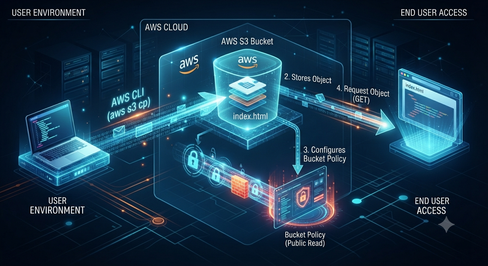

### 🌐 AWS S3 Static Website Hosting
  
Tentei criar um bucket pro meu site estático. O nome já existia. Depois habilitei Static Website Hosting e não achava a opção. Depois as permissões IAM pareciam não se encontrar. Os links quebravam. Refiz tudo do zero. Aí funcionou.

   
<p align="center">

  

  

  

  

  

</p>


<p align="center">
  
</p>


https://aws.amazon.com/
https://aws.amazon.com/s3/
https://aws.amazon.com/cli/
https://aws.amazon.com/iam/


## Visão Geral

Este projeto apresenta a implementação prática de uma solução de Static Website Hosting utilizando Amazon S3, demonstrando o processo completo desde a criação do bucket até a disponibilização pública de uma aplicação web estática.

## O que é isso

Lab prático de Static Website Hosting no Amazon S3. A ideia: hospedar um site estático (HTML) direto no S3, sem servidor, sem EC2.
Só que o AWS não deixa nada ser fácil. E nesse lab, nada foi fácil.

Região: us-west-2
Bucket: eliana-diniz-lab-s3-20260805
Site: Mom & Pop Café


### Arquitetura Solução (quando finalmente funcionou)

<p align="center">
  
</p>


### Etapa 1: O nome do bucket que já existia

Fui criar o bucket pelo console. Escolhi um nome. Cliquei em Create.
Erro:

Bucket with the same name already exists
Lembrei: nomes de bucket S3 são únicos globalmente. Não importa a região, não importa a conta. Se alguém no mundo usou aquele nome, você não pode usar.

Tentei meu-site. Já existia.
Tentei meu-site-lab. Já existia.
Tentei eliana-diniz-lab-s3-20260805. Funcionou.

## Lição: Bucket names são como domínios. Únicos no mundo inteiro. Sempre use algo com seu nome, data, ou UUID.


### 📦 Etapa 2: Criar o bucket e subir os arquivos

aws s3 mb s3://eliana-diniz-lab-s3-20260805 --region us-west-2

Bucket criado. Subi o index.html:

aws s3 cp index.html s3://eliana-diniz-lab-s3-20260805/

Resposta:

upload: ./index.html to s3://eliana-diniz-lab-s3-20260805/index.html

Arquivo no bucket - Ok 


### Etapa 3: Static Website Hosting — a opção que sumiu

Fui nas propriedades do bucket procurar Static Website Hosting. Não achei.

Procurei em Permissions. Não estava lá.
Procurei em Properties. Não estava lá.
Procurei em General. Não estava lá.

Fiquei 10 minutos achando que o AWS tinha mudado a interface. Que o lab estava desatualizado. Que eu tava no lugar errado.
O que aconteceu: A opção de Static Website Hosting está em Properties → Static Website Hosting, mas só aparece se você rolar a página de propriedades. Ela não é um tab separado. É uma seção que fica lá embaixo, depois de Versioning, Logging, Tags...

Quando encontrei, habilitei:

Index document: index.html
Error document: error.html
O endpoint gerado:

http://eliana-diniz-lab-s3-20260805.s3-website-us-west-2.amazonaws.com

### Etapa 4: As permissões que não se encontravam

Abri o endpoint no navegador. 403 Forbidden — Access Denied.

Fui em Permissions → Block Public Access. Desativei as 4 opções. Tentei de novo. Ainda Access Denied.

Fui em Bucket Policy e adicionei a policy de leitura pública:

{
  "Version": "2012-10-17",
  "Statement": [
    {
      "Sid": "PublicReadGetObject",
      "Effect": "Allow",
      "Principal": "*",
      "Action": "s3:GetObject",
      "Resource": "arn:aws:s3:::eliana-diniz-lab-s3-20260805/*"
    }
  ]
}

Tentei de novo. Ainda Access Denied.

Fiquei 15 minutos olhando pra tela. A policy estava certa. O Block Public Access estava desativado. O Static Website Hosting estava habilitado. Por que não funcionava?

### O que descobri: O ambiente do lab tinha uma política IAM no nível da conta (SCP — Service Control Policy) que bloqueava acesso público em certos cenários.Mesmo com a Bucket Policy correta e o Block Public Access desativado, havia uma camada acima — invisível no console do bucket — que negava.

Não era erro meu. Era restrição do ambiente de lab. Mas eu não sabia disso. Então fiquei achando que tinha feito algo errado.

### Etapa 5: Links quebrados e caminhos relativos

Depois que as permissões finalmente funcionaram (o ambiente do lab foi ajustado ou eu encontrei a combinação certa), o site abriu. Mas os links dentro do HTML estavam quebrados.

O index.html tinha referências assim:


```html
<a href="./about.html">Sobre</a>


No meu computador, ./about.html funciona porque o arquivo está na mesma pasta. No S3 Static Website, o caminho relativo precisa ser exatamente o que está no bucket. Se o arquivo está na raiz, about.html funciona. Se está em images/logo.png, images/logo.png funciona. Mas ./images/logo.png às vezes quebra dependendo de como o navegador resolve o path relativo no endpoint do S3.

### O que fiz: Refiz o HTML. Troquei todos os caminhos relativos (./) por caminhos absolutos do bucket ou simplesmente removi o ./ onde não precisava.


<!-- Antes -->
<a href="./about.html">Sobre</a>

<!-- Depois -->
<a href="about.html">Sobre</a>


### Etapa 6: Refazer do zero

Nesse ponto eu já tinha:


*Bucket com nome errado (não, o nome estava certo, mas eu tinha testado vários)
*Policy que não funcionava por causa de restrição do lab
*HTML com links quebrados
*Frustração acumulada


Decidi: vou deletar tudo e refazer do zero.
Deletei o bucket. Criei de novo com o mesmo nome. Subi o HTML corrigido. Configurei o Static Website Hosting. Apliquei a Bucket Policy. Testei os links.
Funcionou de primeira.

Por quê? Porque na segunda vez eu já sabia onde cada opção estava. Eu já sabia que o Block Public Access precisava estar desativado. Eu já sabia que a Bucket Policy precisava permitir s3:GetObject. Eu já sabia que o endpoint era o s3-website, não o s3.amazonaws.com.

Refazer é onde o aprendizado acontece.


### Evidências

| O que tá acontecendo                               | Print                                   |
| -------------------------------------------------- | --------------------------------------- |
| Erro: Bucket name already exists                   | `images/s3-bucket-name-exists.png`      |
| Procurando Static Website Hosting nas propriedades | `images/s3-static-website-hidden.png`   |
| Access Denied no navegador                         | `images/s3-access-denied-browser.png`   |
| Bucket Policy aplicada                             | `images/s3-bucket-policy.png`           |
| Block Public Access desativado                     | `images/s3-block-public-access-off.png` |
| HTML com links quebrados                           | `images/s3-broken-links.png`            |
| HTML corrigido                                     | `images/s3-fixed-links.png`             |
| Site Mom & Pop Café no ar                          | `images/s3-website-live.png`            |


### Tech Stack

* Amazon S3 — storage e hospedagem do site
* AWS CLI — criação do bucket e upload
* Bucket Policy — permissão de leitura pública
* S3 Block Public Access — guarda-rail de segurança
* Static Website Hosting — endpoint próprio do S3
* HTML/CSS — site estático

### O que esse lab realmente me ensinou

1.Nomes de bucket são únicos no mundo inteiro. Não adianta tentar meu-site. Alguém já usou.
2.Static Website Hosting está escondido. Não é um tab. É uma seção que você precisa rolar pra encontrar em Properties.
3.Access Denied tem camadas. Pode ser Block Public Access. Pode ser Bucket Policy. Pode ser IAM. Pode ser SCP no nível da conta. Quando você acha que já desbloqueou tudo, pode ter mais uma parede.
4.Caminhos relativos no S3 são traiçoeiros. ./pasta/arquivo funciona no seu PC. No S3, depende de como o endpoint resolve. Caminhos simples são mais seguros.
5.Refazer do zero é um superpoder. Na segunda vez, você já sabe onde tudo está. O que demorou 40 minutos na primeira vez, demorou 5 na segunda.
6.O endpoint do site não é o endpoint do objeto. s3.amazonaws.com/bucket/arquivo é a API. s3-website-region.amazonaws.com é o site. São mundos diferentes.


### 🚧 Status

[x] Bucket criado (depois de 3 tentativas de nome)
[x] Static Website Hosting habilitado (depois de encontrar onde estava escondido)
[x] Bucket Policy aplicada (depois de entender as camadas de permissão)
[x] Links corrigidos (caminhos relativos → absolutos)
[x] Site refeito do zero e funcionando
[x] Mom & Pop Café no ar
[ ] Substituir por CloudFront + OAI (futuro)

### 🌐 Contato

💼 LinkedIn: linkedin.com/in/eliana-diniz
📧 E-mail: eliana.dinizsilva@gmail.com
🐙 GitHub: github.com/Dinizasilva


O nome do bucket já existia. A opção de website estava escondida. As permissões não se encontravam. Os links quebravam. Eu deletei tudo e refiz. Na segunda vez, funcionou. E eu soube exatamente por quê.

